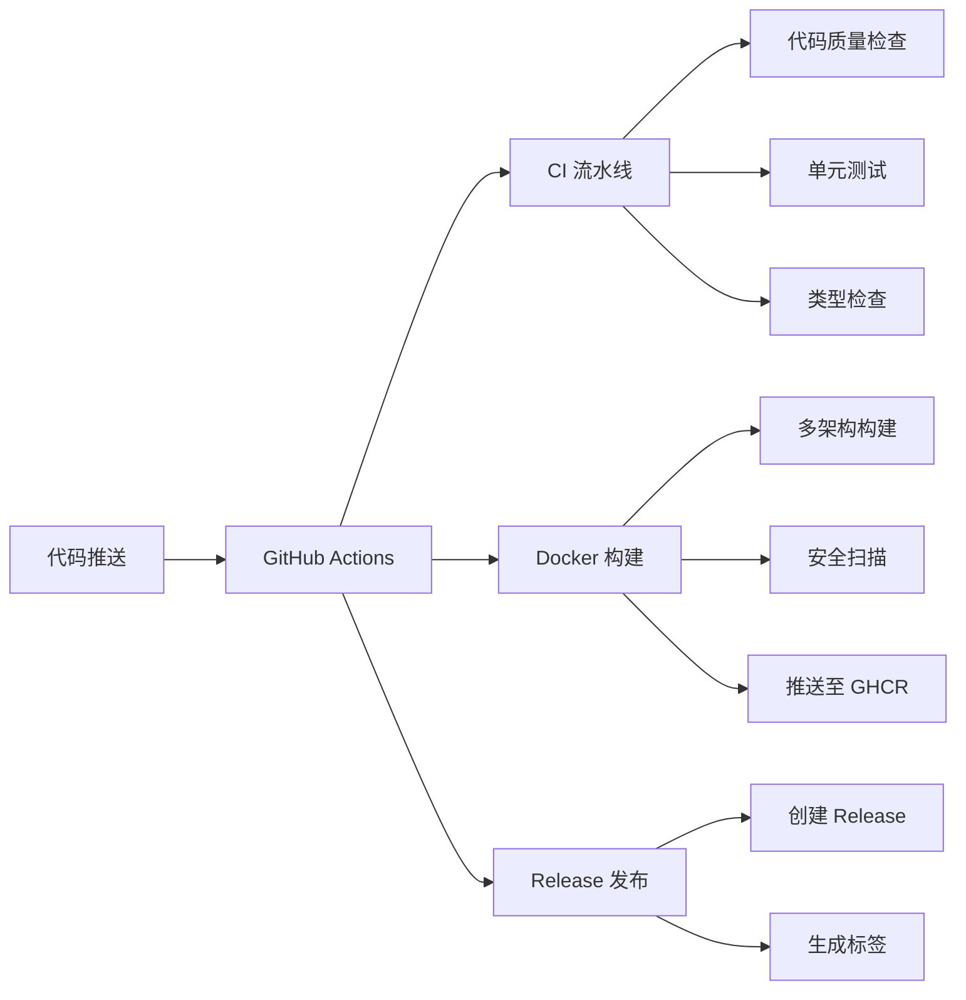

# CI/CD 自动化与 Docker 镜像配置指南

<div align="center">


**现代化部署方案 • 自动化构建 • 多架构支持**

[快速开始](#快速开始) • [CI/CD 配置](#cicd-配置详解) • [Docker 使用](#docker-镜像使用) • [故障排除](#故障排除)

</div>

## 📋 目录

- [概述](#概述)
- [快速开始](#快速开始)
- [CI/CD 配置详解](#cicd-配置详解)
- [Docker 镜像使用](#docker-镜像使用)
- [Kubernetes 部署](#kubernetes-部署)
- [本地开发](#本地开发)
- [监控与日志](#监控与日志)
- [故障排除](#故障排除)
- [最佳实践](#最佳实践)

---

## 概述

NestEidos 项目实现了完整的 CI/CD 自动化流水线和 Docker 容器化部署方案，支持：

- ✅ **自动化测试和代码质量检查**
- ✅ **多架构 Docker 镜像构建** (AMD64/ARM64)
- ✅ **安全漏洞扫描**
- ✅ **自动化版本发布**
- ✅ **GitHub Container Registry 集成**
- ✅ **Kubernetes 部署支持**

### 🏗️ 架构设计



---

## 快速开始

### 1. 环境准备

确保您已安装以下工具：

```bash
# 检查必要工具
docker --version          # Docker 20.10+
kubectl version --client  # kubectl 1.20+ (可选)
git --version            # Git 2.30+
```

### 2. 拉取镜像

```bash
# 拉取最新镜像
docker pull ghcr.io/liushidai/nest-eidos:latest

# 拉取特定版本
docker pull ghcr.io/liushidai/nest-eidos:v1.0.0
```

### 3. 快速运行

```bash
# 使用 docker-compose 快速启动
docker-compose up -d

# 或直接运行 Docker
docker run -d \
  --name nest-eidos \
  -p 3000:3000 \
  --env-file ./.env \
  ghcr.io/liushidai/nest-eidos:latest
```

### 4. 验证部署

```bash
# 检查服务状态
curl http://localhost:3000/health

# 预期响应
{
  "status": "healthy",
  "database": "connected",
  "environment": "production",
  "version": "1.0.0"
}
```

---

## CI/CD 配置详解

### 工作流概览

项目包含三个主要的 GitHub Actions 工作流：

| 工作流 | 触发条件 | 主要功能 |
|--------|----------|----------|
| **ci.yml** | Push/Pull Request | 代码质量检查和测试 |
| **docker.yml** | Push to main/Release | Docker 镜像构建和推送 |
| **release.yml** | 创建 Tag | 自动化版本发布 |

### 1. 持续集成 (ci.yml)

**触发条件**：
- 推送到 `main` 分支
- 创建/更新 Pull Request

**执行步骤**：
```yaml
1. 代码检出 (actions/checkout@v4)
2. Node.js 环境设置 (actions/setup-node@v4)
3. 依赖安装 (npm ci)
4. 代码质量检查 (ESLint, Prettier)
5. 单元测试执行 (npm run test)
6. 类型检查 (npm run build)
```

**配置说明**：
```yaml
# .github/workflows/ci.yml 关键配置
name: CI

on:
  push:
    branches: [ main ]
  pull_request:
    branches: [ main ]

jobs:
  test:
    runs-on: ubuntu-latest

    strategy:
      matrix:
        node-version: [18.x, 20.x]

    steps:
    - uses: actions/checkout@v4

    - name: Setup Node.js
      uses: actions/setup-node@v4
      with:
        node-version: ${{ matrix.node-version }}
        cache: 'npm'

    - name: Install dependencies
      run: npm ci

    - name: Run linting
      run: npm run lint

    - name: Run tests
      run: npm run test:ci

    - name: Build project
      run: npm run build
```

### 2. Docker 镜像构建 (docker.yml)

**触发条件**：
- 推送到 `main` 分支 → 构建 `:latest` 标签
- 创建 Release → 构建版本标签

**多架构支持**：
```yaml
platforms:
  - linux/amd64
  - linux/arm64
```

**构建步骤**：
```yaml
1. 代码检出
2. 设置 Docker Buildx
3. 登录 GitHub Container Registry
4. 多架构镜像构建
5. 安全漏洞扫描 (Trivy)
6. 推送到 GHCR
```

**镜像构建配置**：
```yaml
# .github/workflows/docker.yml 关键配置
name: Build and Push Docker Image

on:
  push:
    branches: [ main ]
  release:
    types: [ published ]

jobs:
  build-and-push:
    runs-on: ubuntu-latest

    steps:
    - uses: actions/checkout@v4

    - name: Set up Docker Buildx
      uses: docker/setup-buildx-action@v3

    - name: Log in to GitHub Container Registry
      uses: docker/login-action@v3
      with:
        registry: ghcr.io
        username: ${{ github.actor }}
        password: ${{ secrets.GITHUB_TOKEN }}

    - name: Extract metadata
      id: meta
      uses: docker/metadata-action@v5
      with:
        images: ghcr.io/liushidai/nest-eidos
        tags: |
          type=ref,event=branch
          type=ref,event=pr
          type=semver,pattern={{version}}
          type=semver,pattern={{major}}.{{minor}}

    - name: Build and push Docker image
      uses: docker/build-push-action@v5
      with:
        context: .
        platforms: linux/amd64,linux/arm64
        push: true
        tags: ${{ steps.meta.outputs.tags }}
        labels: ${{ steps.meta.outputs.labels }}
        cache-from: type=gha
        cache-to: type=gha,mode=max
```

### 3. 版本发布 (release.yml)

**触发条件**：
- 创建 Git Tag

**自动化流程**：
```yaml
1. 检出代码
2. 生成 Release Notes
3. 创建 GitHub Release
4. 触发 Docker 构建
5. 部署到生产环境 (可选)
```

**版本发布配置**：
```yaml
# .github/workflows/release.yml 关键配置
name: Release

on:
  push:
    tags:
      - 'v*'

jobs:
  release:
    runs-on: ubuntu-latest

    steps:
    - uses: actions/checkout@v4

    - name: Generate Release Notes
      id: release_notes
      run: |
        # 生成发布说明

    - name: Create Release
      uses: softprops/action-gh-release@v1
      with:
        body: ${{ steps.release_notes.outputs.notes }}
        generate_release_notes: true
```

---

## Docker 镜像使用

### 镜像标签规范

| 标签类型 | 格式 | 说明 | 示例 |
|----------|------|------|------|
| **最新版本** | `:latest` | 最新的稳定版本 | `ghcr.io/liushidai/nest-eidos:latest` |
| **语义化版本** | `:v1.0.0` | 特定版本 | `ghcr.io/liushidai/nest-eidos:v1.0.0` |
| **主版本** | `:v1` | 主版本分支 | `ghcr.io/liushidai/nest-eidos:v1` |
| **分支版本** | `:main` | 开发分支 | `ghcr.io/liushidai/nest-eidos:main` |

### 镜像特性

- **基础镜像**: `node:18-alpine`
- **镜像大小**: ~170MB
- **架构支持**: AMD64, ARM64
- **安全特性**: 非 root 用户运行
- **健康检查**: 内置 `/health` 端点
- **多阶段构建**: 优化镜像大小

### 环境变量配置

#### 必需环境变量

```bash
# 数据库配置
DB_HOST=localhost
DB_PORT=5432
DB_USERNAME=your_username
DB_PASSWORD=your_password
DB_DATABASE=nest_eidos

# Redis 配置
REDIS_HOST=localhost
REDIS_PORT=6379
REDIS_PASSWORD=your_redis_password

# MinIO 配置
MINIO_ENDPOINT=localhost
MINIO_ACCESS_KEY=your_access_key
MINIO_SECRET_KEY=your_secret_key
MINIO_BUCKET=images

# 安全配置
SECURE_ID_SECRET_KEY=hex:your_64_char_hex_key
```

#### 可选环境变量

```bash
# 应用配置
PORT=3000
NODE_ENV=production
APP_DOMAIN=https://api.example.com

# 功能开关
ENABLE_USER_REGISTRATION=false
ENABLE_SWAGGER=false

# 认证配置
AUTH_TOKEN_EXPIRES_IN=3600
AUTH_BCRYPT_ROUNDS=12

# 上传配置
UPLOAD_MAX_FILE_SIZE=104857600
```

### Docker 运行示例

#### 基础运行

```bash
docker run -d \
  --name nest-eidos \
  -p 3000:3000 \
  -e NODE_ENV=production \
  -e DB_HOST=postgres \
  -e REDIS_HOST=redis \
  -e MINIO_ENDPOINT=minio \
  ghcr.io/liushidai/nest-eidos:latest
```

#### 生产环境运行

```bash
docker run -d \
  --name nest-eidos \
  -p 3000:3000 \
  --restart unless-stopped \
  --memory=512m \
  --cpus=1.0 \
  --env-file ./.env.production \
  -v /app/logs:/app/logs \
  -v /app/uploads:/app/uploads \
  ghcr.io/liushidai/nest-eidos:latest
```

#### Docker Compose 运行

**docker-compose.yml**:
```yaml
version: '3.8'

services:
  app:
    image: ghcr.io/liushidai/nest-eidos:latest
    container_name: nest-eidos
    restart: unless-stopped
    ports:
      - "3000:3000"
    environment:
      - NODE_ENV=production
      - DB_HOST=postgres
      - REDIS_HOST=redis
      - MINIO_ENDPOINT=minio
    depends_on:
      - postgres
      - redis
      - minio
    volumes:
      - ./logs:/app/logs
    healthcheck:
      test: ["CMD", "wget", "--no-verbose", "--tries=1", "--spider", "http://localhost:3000/health"]
      interval: 30s
      timeout: 10s
      retries: 3
      start_period: 40s

  postgres:
    image: postgres:15-alpine
    container_name: postgres
    restart: unless-stopped
    environment:
      POSTGRES_DB: nest_eidos
      POSTGRES_USER: nestuser
      POSTGRES_PASSWORD: nestpass
    volumes:
      - postgres_data:/var/lib/postgresql/data
    ports:
      - "5432:5432"

  redis:
    image: redis:7-alpine
    container_name: redis
    restart: unless-stopped
    command: redis-server --requirepass redispass
    volumes:
      - redis_data:/data
    ports:
      - "6379:6379"

  minio:
    image: minio/minio:latest
    container_name: minio
    restart: unless-stopped
    command: server /data --console-address ":9001"
    environment:
      MINIO_ROOT_USER: minioadmin
      MINIO_ROOT_PASSWORD: minioadmin123
    volumes:
      - minio_data:/data
    ports:
      - "9000:9000"
      - "9001:9001"

volumes:
  postgres_data:
  redis_data:
  minio_data:
```

---

## Kubernetes 部署

### 1. 命名空间配置

```yaml
# namespace.yaml
apiVersion: v1
kind: Namespace
metadata:
  name: nest-eidos
  labels:
    name: nest-eidos
```

### 2. ConfigMap 配置

```yaml
# configmap.yaml
apiVersion: v1
kind: ConfigMap
metadata:
  name: nest-eidos-config
  namespace: nest-eidos
data:
  NODE_ENV: "production"
  PORT: "3000"
  DB_HOST: "postgres-service"
  DB_PORT: "5432"
  REDIS_HOST: "redis-service"
  REDIS_PORT: "6379"
  MINIO_ENDPOINT: "minio-service"
  MINIO_PORT: "9000"
  ENABLE_USER_REGISTRATION: "false"
  ENABLE_SWAGGER: "true"
```

### 3. Secret 配置

```yaml
# secret.yaml
apiVersion: v1
kind: Secret
metadata:
  name: nest-eidos-secrets
  namespace: nest-eidos
type: Opaque
data:
  DB_USERNAME: bmVzdHVzZXI=  # base64 encoded
  DB_PASSWORD: bmVzdHBhc3M=
  REDIS_PASSWORD: cmVkaXNwYXNz
  MINIO_ACCESS_KEY: bWluaW9hZG1pbg==
  MINIO_SECRET_KEY: bWluaW9hZG1pbjEyMw==
  SECURE_ID_SECRET_KEY: aGV4OjEyMzQ1Njc4OTBhYmNkZWYxMjM0NTY3ODkwYWJjZGVmMTIzNDU2Nzg5MGFiY2RlZjEyMzQ1Njc4OTBhYmNkZWY=
```

### 4. Deployment 配置

```yaml
# deployment.yaml
apiVersion: apps/v1
kind: Deployment
metadata:
  name: nest-eidos-deployment
  namespace: nest-eidos
  labels:
    app: nest-eidos
spec:
  replicas: 3
  selector:
    matchLabels:
      app: nest-eidos
  template:
    metadata:
      labels:
        app: nest-eidos
    spec:
      containers:
      - name: nest-eidos
        image: ghcr.io/liushidai/nest-eidos:latest
        imagePullPolicy: Always
        ports:
        - containerPort: 3000
        envFrom:
        - configMapRef:
            name: nest-eidos-config
        - secretRef:
            name: nest-eidos-secrets
        resources:
          requests:
            memory: "256Mi"
            cpu: "250m"
          limits:
            memory: "512Mi"
            cpu: "500m"
        livenessProbe:
          httpGet:
            path: /health/liveness
            port: 3000
          initialDelaySeconds: 30
          periodSeconds: 10
          timeoutSeconds: 3
          failureThreshold: 3
        readinessProbe:
          httpGet:
            path: /health/readiness
            port: 3000
          initialDelaySeconds: 5
          periodSeconds: 5
          timeoutSeconds: 2
          failureThreshold: 3
        securityContext:
          runAsNonRoot: true
          runAsUser: 1001
          allowPrivilegeEscalation: false
          readOnlyRootFilesystem: true
          capabilities:
            drop:
            - ALL
```

### 5. Service 配置

```yaml
# service.yaml
apiVersion: v1
kind: Service
metadata:
  name: nest-eidos-service
  namespace: nest-eidos
spec:
  selector:
    app: nest-eidos
  ports:
    - protocol: TCP
      port: 80
      targetPort: 3000
  type: ClusterIP
```

### 6. Ingress 配置

```yaml
# ingress.yaml
apiVersion: networking.k8s.io/v1
kind: Ingress
metadata:
  name: nest-eidos-ingress
  namespace: nest-eidos
  annotations:
    kubernetes.io/ingress.class: nginx
    cert-manager.io/cluster-issuer: letsencrypt-prod
    nginx.ingress.kubernetes.io/proxy-body-size: "100m"
spec:
  tls:
  - hosts:
    - api.example.com
    secretName: nest-eidos-tls
  rules:
  - host: api.example.com
    http:
      paths:
      - path: /
        pathType: Prefix
        backend:
          service:
            name: nest-eidos-service
            port:
              number: 80
```

### 7. 部署命令

```bash
# 应用所有配置
kubectl apply -f k8s/

# 检查部署状态
kubectl get pods -n nest-eidos

# 查看服务状态
kubectl get services -n nest-eidos

# 查看日志
kubectl logs -f deployment/nest-eidos-deployment -n nest-eidos
```

---

## 本地开发

### 1. 开发环境设置

```bash
# 克隆项目
git clone https://github.com/liushidai/NestEidos.git
cd NestEidos

# 安装依赖
npm install

# 启动开发服务器
npm run start:dev
```

### 2. Docker 本地开发

```bash
# 构建本地镜像
docker build -t nest-eidos:local .

# 运行本地镜像
docker run -d \
  --name nest-eidos-dev \
  -p 3000:3000 \
  --env-file ./.env.local \
  nest-eidos:local
```

### 3. Docker Compose 开发环境

```bash
# 启动完整开发环境
docker-compose -f docker-compose.dev.yml up -d

# 查看日志
docker-compose -f docker-compose.dev.yml logs -f

# 停止服务
docker-compose -f docker-compose.dev.yml down
```

### 4. 调试配置

**VS Code 调试配置** (.vscode/launch.json):
```json
{
  "version": "0.2.0",
  "configurations": [
    {
      "name": "Debug NestJS",
      "type": "node",
      "request": "launch",
      "program": "${workspaceFolder}/src/main.ts",
      "preLaunchTask": "tsc: build - tsconfig.json",
      "outFiles": ["${workspaceFolder}/dist/**/*.js"],
      "env": {
        "NODE_ENV": "development"
      },
      "console": "integratedTerminal",
      "restart": true,
      "runtimeExecutable": "nodemon"
    }
  ]
}
```

---

## 监控与日志

### 1. 健康检查监控

```bash
# 基础健康检查
curl http://localhost:3000/health

# 详细健康信息
curl http://localhost:3000/health/detailed

# Kubernetes 存活检查
curl http://localhost:3000/health/liveness

# Kubernetes 就绪检查
curl http://localhost:3000/health/readiness
```

### 2. 日志管理

#### 应用日志

```bash
# 查看容器日志
docker logs nest-eidos

# 实时日志
docker logs -f nest-eidos

# Kubernetes 日志
kubectl logs -f deployment/nest-eidos-deployment -n nest-eidos
```

#### 日志配置

```typescript
// 日志级别配置
const logLevels = {
  development: 'debug',
  production: 'info',
  test: 'warn',
};

// 结构化日志
this.logger.log({
  message: 'User login successful',
  userId: '12345',
  timestamp: new Date().toISOString(),
  request: {
    ip: '192.168.1.1',
    userAgent: 'Mozilla/5.0...',
  },
});
```

### 3. Prometheus 监控集成

```typescript
// src/metrics/metrics.service.ts
import { Injectable } from '@nestjs/common';
import { register, Counter, Histogram, Gauge } from 'prom-client';

@Injectable()
export class MetricsService {
  private httpRequestsTotal: Counter;
  private httpRequestDuration: Histogram;
  private activeConnections: Gauge;

  constructor() {
    this.httpRequestsTotal = new Counter({
      name: 'http_requests_total',
      help: 'Total number of HTTP requests',
      labelNames: ['method', 'route', 'status'],
    });

    this.httpRequestDuration = new Histogram({
      name: 'http_request_duration_seconds',
      help: 'Duration of HTTP requests in seconds',
      labelNames: ['method', 'route'],
      buckets: [0.1, 0.3, 0.5, 0.7, 1, 3, 5, 7, 10],
    });

    this.activeConnections = new Gauge({
      name: 'active_connections',
      help: 'Number of active connections',
    });
  }

  incrementHttpRequests(method: string, route: string, status: string) {
    this.httpRequestsTotal.inc({ method, route, status });
  }

  observeRequestDuration(method: string, route: string, duration: number) {
    this.httpRequestDuration.observe({ method, route }, duration);
  }

  setActiveConnections(count: number) {
    this.activeConnections.set(count);
  }
}
```

### 4. Grafana 仪表盘

**常用监控指标**：

```promql
# HTTP 请求总数
sum(rate(http_requests_total[5m])) by (method, route)

# 平均响应时间
histogram_quantile(0.95, sum(rate(http_request_duration_seconds_bucket[5m])) by (le, method, route))

# 活跃连接数
active_connections

# 容器资源使用
container_memory_usage_bytes{pod=~"nest-eidos-.*"}
container_cpu_usage_seconds_total{pod=~"nest-eidos-.*"}
```

---

## 故障排除

### 1. 常见问题

#### 镜像构建失败

**问题**: Docker 构建过程中出现错误
```bash
Error: failed to solve: process "/bin/sh -c npm ci" did not complete successfully
```

**解决方案**:
```bash
# 检查 package.json 和 package-lock.json 版本
npm ls

# 清理 npm 缓存
npm cache clean --force

# 重新生成 package-lock.json
rm package-lock.json
npm install
```

#### 健康检查失败

**问题**: 容器启动后健康检查失败
```bash
Health check failed: unhealthy
```

**解决方案**:
```bash
# 检查应用是否正常启动
docker logs nest-eidos

# 手动测试健康检查端点
curl http://localhost:3000/health

# 检查环境变量配置
docker exec nest-eidos env | grep -E "(DB_|REDIS_|MINIO_)"
```

#### 数据库连接问题

**问题**: 应用无法连接到数据库
```bash
Error: connect ECONNREFUSED 127.0.0.1:5432
```

**解决方案**:
```bash
# 检查数据库服务状态
docker ps | grep postgres

# 测试数据库连接
docker exec -it postgres psql -U nestuser -d nest_eidos

# 检查网络连接
docker network ls
docker network inspect nest-eidos_default
```

#### Redis 连接问题

**问题**: Redis 连接超时
```bash
Error: Redis connection timeout
```

**解决方案**:
```bash
# 检查 Redis 服务
docker ps | grep redis

# 测试 Redis 连接
docker exec -it redis redis-cli ping

# 检查 Redis 配置
docker exec redis redis-cli config get "*timeout*"
```

### 2. 性能问题

#### 内存使用过高

**诊断**:
```bash
# 检查容器内存使用
docker stats nest-eidos

# 检查 Node.js 进程内存
docker exec nest-eidos node -e "console.log(process.memoryUsage())"
```

**优化方案**:
```yaml
# 在 docker-compose.yml 中设置内存限制
services:
  app:
    deploy:
      resources:
        limits:
          memory: 512M
        reservations:
          memory: 256M
```

#### 响应时间过长

**诊断**:
```bash
# 测试 API 响应时间
time curl http://localhost:3000/api/albums

# 检查数据库查询性能
docker exec postgres psql -U nestuser -d nest_eidos -c "SELECT * FROM pg_stat_activity;"
```

### 3. CI/CD 问题

#### GitHub Actions 失败

**问题**: CI 流水线执行失败
```bash
Error: npm test failed
```

**排查步骤**:
1. 检查 Actions 日志
2. 本地运行相同命令
3. 检查依赖版本兼容性
4. 验证测试数据和环境

#### Docker 推送失败

**问题**: 镜像推送到 GHCR 失败
```bash
Error: denied: permission denied
```

**解决方案**:
```yaml
# 确保 GitHub Actions 有正确权限
permissions:
  contents: read
  packages: write

# 检查 secrets.GITHUB_TOKEN 是否正确设置
- name: Log in to GitHub Container Registry
  uses: docker/login-action@v3
  with:
    registry: ghcr.io
    username: ${{ github.actor }}
    password: ${{ secrets.GITHUB_TOKEN }}
```

### 4. 安全问题

#### 容器安全扫描

**使用 Trivy 扫描镜像**:
```bash
# 安装 Trivy
brew install trivy

# 扫描镜像
trivy image ghcr.io/liushidai/nest-eidos:latest

# 扫描文件系统
trivy fs .
```

#### 漏洞修复

**常见修复方案**:
```dockerfile
# 使用更安全的基础镜像
FROM node:18-alpine AS builder

# 定期更新依赖
RUN npm audit fix

# 移除不必要的包
RUN apk del --no-network python3 make g++
```

---

## 最佳实践

### 1. 开发最佳实践

#### 代码质量

```bash
# 代码格式化
npm run format

# 代码检查
npm run lint

# 类型检查
npm run type-check

# 运行所有检查
npm run check
```

#### 提交规范

```bash
# 使用约定式提交
git commit -m "feat(auth): add token refresh mechanism"

# 提交前检查
npm run pre-commit

# 自动格式化
npm run pre-commit:fix
```

### 2. Docker 最佳实践

#### 镜像优化

```dockerfile
# 多阶段构建
FROM node:18-alpine AS builder
WORKDIR /app
COPY package*.json ./
RUN npm ci --only=production

FROM node:18-alpine AS runner
WORKDIR /app
COPY --from=builder /app/node_modules ./node_modules
COPY --from=builder /app/dist ./dist

# 非 root 用户
RUN addgroup -g 1001 -S nodejs
RUN adduser -S nextjs -u 1001
USER nextjs

# 健康检查
HEALTHCHECK --interval=30s --timeout=3s --start-period=5s --retries=3 \
  CMD node -e "require('http').get('http://localhost:3000/health', (res) => { \
    process.exit(res.statusCode >= 200 && res.statusCode < 300 ? 0 : 1) \
  }).on('error', () => process.exit(1))"
```

#### 环境变量管理

```bash
# 使用 .env 文件
docker run --env-file ./.env ghcr.io/liushidai/nest-eidos:latest

# 使用 Kubernetes Secrets
envFrom:
  - secretRef:
      name: app-secrets
```

### 3. 生产环境最佳实践

#### 监控配置

```yaml
# 资源限制
resources:
  requests:
    memory: "256Mi"
    cpu: "250m"
  limits:
    memory: "512Mi"
    cpu: "500m"

# 健康检查配置
livenessProbe:
  httpGet:
    path: /health/liveness
    port: 3000
  initialDelaySeconds: 30
  periodSeconds: 10
  timeoutSeconds: 3
  failureThreshold: 3

readinessProbe:
  httpGet:
    path: /health/readiness
    port: 3000
  initialDelaySeconds: 5
  periodSeconds: 5
  timeoutSeconds: 2
  failureThreshold: 3
```

#### 安全配置

```yaml
# 安全上下文
securityContext:
  runAsNonRoot: true
  runAsUser: 1001
  allowPrivilegeEscalation: false
  readOnlyRootFilesystem: true
  capabilities:
    drop:
    - ALL

# 网络策略
apiVersion: networking.k8s.io/v1
kind: NetworkPolicy
metadata:
  name: nest-eidos-netpol
spec:
  podSelector:
    matchLabels:
      app: nest-eidos
  policyTypes:
  - Ingress
  - Egress
```

### 4. 运维最佳实践

#### 备份策略

```bash
# 数据库备份
kubectl exec -it postgres-0 -- pg_dump -U nestuser nest_eidos > backup.sql

# Redis 备份
kubectl exec -it redis-0 -- redis-cli BGSAVE
```

#### 更新策略

```yaml
# 滚动更新
strategy:
  type: RollingUpdate
  rollingUpdate:
    maxSurge: 1
    maxUnavailable: 0

# 蓝绿部署
apiVersion: argoproj.io/v1alpha1
kind: Rollout
spec:
  strategy:
    blueGreen:
      activeService: nest-eidos-active
      previewService: nest-eidos-preview
```

#### 日志聚合

```yaml
# Fluentd 配置
apiVersion: v1
kind: ConfigMap
metadata:
  name: fluentd-config
data:
  fluent.conf: |
    <source>
      @type tail
      path /var/log/containers/*nest-eidos*.log
      pos_file /var/log/fluentd-containers.log.pos
      tag nest-eidos.*
      format json
    </source>

    <match nest-eidos.**>
      @type elasticsearch
      host elasticsearch
      port 9200
      index_name nest-eidos
    </match>
```

---

## 📚 参考资源

### 官方文档

- [NestJS 文档](https://docs.nestjs.com/)
- [Docker 文档](https://docs.docker.com/)
- [Kubernetes 文档](https://kubernetes.io/docs/)
- [GitHub Actions 文档](https://docs.github.com/en/actions)

### 工具链接

- [GitHub Container Registry](https://github.com/features/packages)
- [Trivy 安全扫描](https://github.com/aquasecurity/trivy)
- [Prometheus 监控](https://prometheus.io/)
- [Grafana 可视化](https://grafana.com/)

### 社区资源

- [Docker 最佳实践](https://docs.docker.com/develop/dev-best-practices/)
- [Kubernetes 最佳实践](https://kubernetes.io/docs/concepts/cluster-administration/))
- [NestJS 部署指南](https://docs.nestjs.com/recipes/deployment)

---

**版本**: v1.0.0 | **最后更新**: 2025年1月

如有问题或建议，请提交 [Issue](https://github.com/liushidai/NestEidos/issues) 或 [Pull Request](https://github.com/liushidai/NestEidos/pulls)。