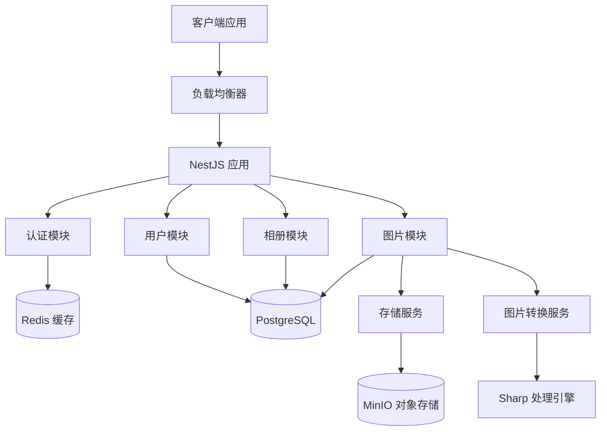

# NestEidos - 企业级图床服务

<div align="center">


[](https://nestjs.com/)
[](https://www.typescriptlang.org/)
[](https://www.postgresql.org/)
[](https://redis.io/)
[](https://min.io/)

[](LICENSE)
[](https://github.com/liushidai/NestEidos)

**高性能 · 安全可靠 · 功能完整 · 易于部署**

[快速开始](#快速开始) • [功能特性](#功能特性) • [API文档](#api文档) • [部署指南](#部署指南)

</div>

## 项目简介

NestEidos 是一个基于 **NestJS** 构建的企业级图床服务，提供完整的图片上传、存储、转换和访问解决方案。系统采用现代化技术栈，支持多格式智能转换、缓存优化、安全防护等企业级特性。

### 核心优势

- 🚀 **高性能**: Redis 缓存 + 智能图片格式转换 (WebP/AVIF)
- 🔒 **安全可靠**: 自定义Token认证 + 安全ID加密 + 多层防护
- 📁 **智能存储**: MinIO 对象存储 + 多格式自动转换
- 🎯 **易用性强**: RESTful API + Swagger 文档 + 统一响应格式
- 🔧 **易于扩展**: 模块化架构 + Repository 模式 + 依赖注入
- 📱 **生产就绪**: 完整的错误处理 + 日志记录 + 配置管理

## 技术栈

### 核心框架
- **NestJS** 11.0.1 - 企业级 Node.js 应用框架
- **TypeScript** 5.0+ - 类型安全的 JavaScript 超集

### 数据层
- **PostgreSQL** 15+ - 主数据库，存储业务数据
- **TypeORM** 0.3.20 - 强大的 ORM 框架
- **Redis** 7.0+ - 高性能缓存和会话存储

### 存储与处理
- **MinIO** 8.0+ - S3 兼容的对象存储服务
- **Sharp** 0.34+ - 高性能图片处理库

### 认证与安全
- **自定义 Token** - 基于雪花算法的无状态身份认证
- **BCrypt** - 安全的密码哈希
- **Feistel网络** - 安全ID加密，防止批量扫描

### 文档与开发
- **Swagger** 11.0+ - 自动化 API 文档生成
- **Jest** 29.7+ - 企业级测试框架
- **ESLint + Prettier** - 代码质量与格式化

## 功能特性

### 🔐 用户认证与授权
- **用户注册/登录**: 安全的用户认证流程，支持注册开关控制
- **自定义 Token**: 基于雪花算法的无状态身份验证
- **角色管理**: 管理员/普通用户权限区分
- **账户安全**: 失败尝试限制 + 账户锁定机制
- **管理员功能**: 完整的用户管理接口，支持用户状态管理、密码重置等
- **注册控制**: 通过环境变量 `ENABLE_USER_REGISTRATION` 动态控制用户注册功能

### 📸 图片处理与管理
- **多格式支持**: JPEG、PNG、GIF、WebP、AVIF、BMP
- **智能转换**: 自动生成多格式副本，按需返回最优格式
- **质量控制**: 4种预设质量级别 (通用/高质量/极限压缩/UI锐利)
- **元数据提取**: 自动提取尺寸、透明度、动画等信息
- **NSFW检测**: 预留的内容安全检测接口

### 🗂️ 相册管理
- **分类组织**: 用户级别的相册管理
- **权限控制**: 用户只能管理自己的相册
- **灵活归属**: 支持未分类图片 (album_id = 0)

### 🌐 图片访问与分发
- **公开访问**: `/i/{secureId}` 无需认证的直接访问接口
- **格式指定**: 支持 `.jpg`、`.webp`、`.avif` 后缀指定格式
- **智能缓存**: 长期缓存 (1年) + ETag 支持
- **404处理**: 多种风格的 404 图片，内嵌 SVG 无需文件依赖

### 🚀 性能优化
- **Redis 缓存**: 多层缓存策略，大幅提升响应速度
- **缓存穿透防护**: 智能空值缓存，防止恶意查询
- **图片优化**: 自动格式转换，减小文件体积
- **数据库优化**: Repository 模式 + 索引优化

### 🛡️ 安全特性
- **安全ID**: Feistel 网络加密的短路径，防止 ID 泄露和扫描
- **密码安全**: BCrypt 加密存储，默认 10 轮加盐
- **输入验证**: 基于 class-validator 的参数验证
- **SQL 注入防护**: TypeORM 提供的 ORM 层防护

## 项目架构

### 系统架构图



### 目录结构

```
src/
├── app.module.ts                 # 根模块
├── main.ts                       # 应用入口
├── config/                       # 配置管理
│   ├── database.config.ts        # 数据库配置
│   ├── redis.config.ts           # Redis 配置
│   ├── auth.config.ts            # 认证配置
│   └── storage.config.ts         # 存储配置
├── modules/                      # 业务模块
│   ├── auth/                     # 认证模块
│   │   ├── auth.module.ts
│   │   ├── auth.service.ts
│   │   ├── auth.controller.ts
│   │   ├── guards/               # 认证守卫
│   │   └── dto/                  # 数据传输对象
│   ├── system/                   # 系统配置模块
│   │   ├── system.module.ts
│   │   ├── system.controller.ts
│   │   ├── dto/                  # 系统配置DTO
│   │   └── system.controller.spec.ts  # 单元测试
│   ├── user/                     # 用户模块
│   │   ├── user.module.ts
│   │   ├── user.service.ts
│   │   ├── entities/             # 用户实体
│   │   ├── repositories/         # 数据访问层
│   │   └── dto/
│   ├── album/                    # 相册模块
│   │   ├── album.module.ts
│   │   ├── album.service.ts
│   │   ├── entities/
│   │   ├── repositories/
│   │   └── dto/
│   └── image/                    # 图片模块
│       ├── image.module.ts
│       ├── image.service.ts
│       ├── entities/
│       ├── repositories/
│       ├── dto/
│       └── controllers/          # 图片控制器
├── services/                     # 核心服务
│   ├── storage.service.ts        # 对象存储服务
│   ├── image-conversion.service.ts # 图片转换服务
│   └── temp-file.service.ts      # 临时文件服务
├── cache/                        # 缓存模块
│   ├── cache.module.ts
│   └── cache.service.ts
├── utils/                        # 工具类
│   ├── snowflake.util.ts         # 雪花算法ID生成
│   ├── secure-id.util.ts         # 安全ID处理
│   └── common.util.ts            # 通用工具
├── interceptors/                 # 拦截器
│   └── response.interceptor.ts   # 统一响应格式
├── filters/                      # 异常过滤器
│   └── http-exception.filter.ts  # 全局异常处理
├── decorators/                   # 装饰器
│   └── strong-password.decorator.ts
├── pipes/                        # 管道
│   └── file-validation.pipe.ts   # 文件验证
└── common/                       # 公共组件
    ├── constants/                # 常量定义
    └── interfaces/               # 接口定义
```

### 数据库设计

#### 用户表 (user)
```sql
CREATE TABLE user (
    id BIGINT PRIMARY KEY,              -- 雪花算法ID
    user_name VARCHAR(64) UNIQUE,       -- 用户名
    pass_word VARCHAR(255),             -- BCrypt加密密码
    user_type SMALLINT DEFAULT 10,      -- 用户类型 (1-管理员, 10-普通用户)
    user_status SMALLINT DEFAULT 1,     -- 用户状态 (1-正常, 2-封锁)
    created_at TIMESTAMP DEFAULT NOW(),
    updated_at TIMESTAMP DEFAULT NOW()
);
```

#### 相册表 (album)
```sql
CREATE TABLE album (
    id BIGINT PRIMARY KEY,              -- 雪花算法ID
    user_id BIGINT NOT NULL,            -- 所属用户ID
    album_name VARCHAR(128) NOT NULL,   -- 相册名称
    created_at TIMESTAMP DEFAULT NOW(),
    updated_at TIMESTAMP DEFAULT NOW(),
    FOREIGN KEY (user_id) REFERENCES user(id)
);
```

#### 图片表 (image)
```sql
CREATE TABLE image (
    id BIGINT PRIMARY KEY,                    -- 雪花算法ID
    user_id BIGINT NOT NULL,                  -- 所属用户ID
    album_id BIGINT NOT NULL DEFAULT 0,       -- 所属相册ID (0表示未分类)
    original_name VARCHAR(255) NOT NULL,       -- 原始文件名
    title VARCHAR(255),                       -- 图片标题
    image_hash CHAR(64) NOT NULL,              -- SHA256哈希 (完整性校验)
    image_size BIGINT NOT NULL CHECK (image_size >= 0), -- 文件大小 (字节)
    image_mime_type VARCHAR(64) NOT NULL,      -- MIME类型
    image_width INTEGER NOT NULL CHECK (image_width > 0), -- 图片宽度
    image_height INTEGER NOT NULL CHECK (image_height > 0), -- 图片高度
    has_transparency BOOLEAN NOT NULL DEFAULT FALSE, -- 是否有透明通道
    is_animated BOOLEAN NOT NULL DEFAULT FALSE,     -- 是否为动画
    secure_url VARCHAR(512) NOT NULL,          -- 安全URL，防止遍历

    -- 存储路径 (MinIO 对象键)
    original_key VARCHAR(512) NOT NULL,        -- 原图存储路径
    jpeg_key VARCHAR(512),                     -- JPEG格式路径
    webp_key VARCHAR(512),                     -- WebP格式路径
    avif_key VARCHAR(512),                     -- AVIF格式路径

    -- 格式标识
    has_jpeg BOOLEAN NOT NULL DEFAULT FALSE,    -- 是否已生成JPEG
    has_webp BOOLEAN NOT NULL DEFAULT FALSE,    -- 是否已生成WebP
    has_avif BOOLEAN NOT NULL DEFAULT FALSE,    -- 是否已生成AVIF

    -- 转换参数 (JSONB格式)
    convert_jpeg_param JSONB NOT NULL DEFAULT '{}'::jsonb, -- JPEG转换参数
    convert_webp_param JSONB NOT NULL DEFAULT '{}'::jsonb, -- WebP转换参数
    convert_avif_param JSONB NOT NULL DEFAULT '{}'::jsonb, -- AVIF转换参数

    -- 业务配置
    default_format VARCHAR(20) NOT NULL DEFAULT 'avif', -- 默认返回格式
    expire_policy SMALLINT NOT NULL,          -- 过期策略 (1-永久, 2-指定时间, 3-限时删除)
    expires_at TIMESTAMP NOT NULL DEFAULT '9999-12-31 23:59:59'::timestamp, -- 过期时间
    nsfw_score REAL CHECK (nsfw_score >= 0.0 AND nsfw_score <= 1.0), -- NSFW评分

    created_at TIMESTAMP WITHOUT TIME ZONE NOT NULL,
    updated_at TIMESTAMP WITHOUT TIME ZONE NOT NULL,

    -- 约束
    CONSTRAINT chk_image_default_format CHECK (default_format IN ('original','jpeg','webp','avif')),
    CONSTRAINT chk_image_expire_policy CHECK (expire_policy IN (1, 2, 3))
);
```

## API 文档

### 接口概览

| 模块 | 端点 | 方法 | 认证 | 描述 |
|------|------|------|------|------|
| **认证** | `/auth/register` | POST | ❌ | 用户注册 (支持注册开关控制) |
| **认证** | `/auth/login` | POST | ❌ | 用户登录 |
| **认证** | `/auth/profile` | GET | ✅ | 获取当前用户信息 |
| **认证** | `/auth/logout` | POST | ✅ | 用户注销 |

| 模块 | 端点 | 方法 | 认证 | 描述 |
|------|------|------|------|------|
| **用户** | `/user/profile` | GET | ✅ | 获取用户详细信息 |
| **用户** | `/user/check-auth` | GET | ✅ | 检查认证状态 |

| 模块 | 端点 | 方法 | 认证 | 描述 |
|------|------|------|------|------|
| **管理员** | `/admin/users` | GET | ✅ (管理员) | 分页获取用户列表 |
| **管理员** | `/admin/user/:id` | GET | ✅ (管理员) | 获取用户详细信息 |
| **管理员** | `/admin/user/:id/status` | PUT | ✅ (管理员) | 切换用户状态 |
| **管理员** | `/admin/user/:id/reset-password` | PUT | ✅ (管理员) | 重置用户密码 |
| **管理员** | `/admin/user/:id/exists` | GET | ✅ (管理员) | 检查用户是否存在 |

| 模块 | 端点 | 方法 | 认证 | 描述 |
|------|------|------|------|------|
| **相册** | `/album` | POST | ✅ | 创建相册 |
| **相册** | `/album/:id` | GET | ✅ | 获取相册详情 |
| **相册** | `/album/:id` | PATCH | ✅ | 修改相册名称 |
| **相册** | `/album/:id` | DELETE | ✅ | 删除相册 |

| 模块 | 端点 | 方法 | 认证 | 描述 |
|------|------|------|------|------|
| **图片** | `/image/upload` | POST | ✅ | 上传图片 |
| **图片** | `/images` | GET | ✅ | 获取图片列表 |
| **图片** | `/image/:id` | DELETE | ✅ | 删除图片 |

| 模块 | 端点 | 方法 | 认证 | 描述 |
|------|------|------|------|------|
| **系统** | `/system/config` | GET | ❌ | 获取系统配置信息 |

| 模块 | 端点 | 方法 | 认证 | 描述 |
|------|------|------|------|------|
| **访问** | `/i/{secureId}` | GET | ❌ | 图片公开访问 |
| **访问** | `/i/{secureId}.jpg` | GET | ❌ | 获取JPEG格式 |
| **访问** | `/i/{secureId}.webp` | GET | ❌ | 获取WebP格式 |
| **访问** | `/i/{secureId}.avif` | GET | ❌ | 获取AVIF格式 |
| **访问** | `/i/{secureId}.original` | GET | ❌ | 获取原始格式 |

### 📖 在线文档

启动服务后，可通过以下地址访问 API 文档：

- **Swagger UI**: http://localhost:3000/api
- **JSON 格式**: http://localhost:3000/api-json

## 快速开始

### 环境要求

- **Node.js** 18.0+
- **PostgreSQL** 13+
- **Redis** 6.0+
- **MinIO** (可选，支持 S3 兼容存储)

### 安装依赖

```bash
# 克隆项目
git clone https://github.com/liushidai/NestEidos.git
cd NestEidos

# 安装依赖
npm install
```

### 环境配置

创建 `.env` 文件并配置环境变量。详细的配置说明请参考 `.env.example` 文件：

```env
# 数据库配置 (PostgreSQL)
DB_HOST=localhost
DB_PORT=5432
DB_USERNAME=postgres
DB_PASSWORD=your_password
DB_DATABASE=nest_eidos

# Redis 缓存配置
REDIS_HOST=localhost
REDIS_PORT=6379
REDIS_PASSWORD=your_redis_password_here
REDIS_DB=0
REDIS_KEY_PREFIX=nest_eidos:

# 认证系统配置
AUTH_TOKEN_EXPIRES_IN=3600
AUTH_TOKEN_BYTES_LENGTH=32
AUTH_BCRYPT_ROUNDS=10
AUTH_MAX_LOGIN_ATTEMPTS=5
AUTH_LOCKOUT_TIME=900

# MinIO 对象存储配置
MINIO_ENDPOINT=localhost
MINIO_PORT=9000
MINIO_ACCESS_KEY=your_minio_access_key
MINIO_SECRET_KEY=your_minio_secret_key
MINIO_BUCKET=images
MINIO_USE_SSL=false

# 安全ID加密配置
SECURE_ID_SECRET_KEY=hex:1234567890abcdef1234567890abcdef1234567890abcdef1234567890abcdef

# 应用基础配置
PORT=3000
NODE_ENV=development

# 文件上传配置
UPLOAD_MAX_FILE_SIZE=104857600

# 用户注册配置
ENABLE_USER_REGISTRATION=true        # 是否开启用户注册功能 (true=开启注册, false=关闭注册)
                                    # 生产环境建议设置为 false，由管理员手动创建用户账户
```

**重要提示**：
- 生产环境中必须使用强密码和密钥
- `SECURE_ID_SECRET_KEY` 应使用 `openssl rand -hex 32` 生成
- 生产环境建议设置 `ENABLE_USER_REGISTRATION=false` 关闭公开注册，由管理员手动创建用户账户
- 详细的配置说明和安全建议请参考 `.env.example` 文件

### 启动服务

```bash
# 开发模式 (热重载)
npm run start:dev

# 生产模式
npm run build
npm run start:prod

# 测试模式
npm run test
```

### 验证安装

访问 http://localhost:3000，如果看到服务正常运行，说明安装成功。

## 部署指南

### 传统部署

```bash
# 构建项目
npm run build

# 启动生产服务
npm run start:prod
```

### Docker 部署 (可选)

如需使用 Docker 部署，可创建以下 `Dockerfile`：

```dockerfile
FROM node:18-alpine

WORKDIR /app

COPY package*.json ./
RUN npm ci --only=production

COPY . .
RUN npm run build

EXPOSE 3000

CMD ["npm", "run", "start:prod"]
```

```bash
# 构建镜像
docker build -t nest-eidos .

# 运行容器
docker run -d \
  --name nest-eidos \
  -p 3000:3000 \
  --env-file ./.env \
  nest-eidos
```

### 生产环境配置

生产环境建议使用：

- **反向代理**: Nginx / Caddy
- **进程管理**: PM2 / Docker
- **监控**: Prometheus + Grafana
- **日志**: ELK Stack / Grafana Loki
- **数据库连接池**: 配置合适的连接池大小

### 性能优化建议

1. **缓存策略**: 启用 Redis 缓存，设置合适的 TTL
2. **图片优化**: 启用多格式转换，减小传输体积
3. **CDN 加速**: 使用 CDN 分发静态资源
4. **数据库优化**: 添加适当索引，定期维护
5. **压缩**: 启用 Gzip / Brotli 压缩

## 开发指南

### 代码规范

项目采用严格的开发规范，详见 [CODING_STANDARDS.md](./CODING_STANDARDS.md)。

### 测试

```bash
# 运行单元测试
npm run test

# 运行测试并生成覆盖率报告
npm run test:cov

# 运行端到端测试
npm run test:e2e
```

### 构建

```bash
# 构建生产版本
npm run build

# 构建并启动
npm run build && npm run start:prod
```